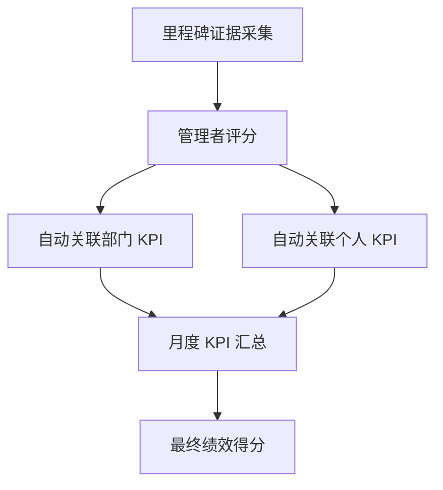

## 业务背景

给运营管理部门的负责人做的一套 KPI 绩效管理系统。

公司以前的 KPI 考核是怎么做的？说白了就是 Excel 大法——HR 建好模板，各部门负责人填分，然后 HR 再汇总。每个月光对数据就头大，更别说中间还有改分、补分、退回重新打分的情况。另外目标，执行的过程，效果都缺少管理，导致公司级项目混乱，目标完成情况缺少管理证据无法考核。KPI打分全凭拍脑袋。

几个核心痛点：

1. **三级 KPI 断裂** —— 公司级 KPI、部门级 KPI、个人 KPI 之间没有联动关系，上面定了目标，下面怎么承接全靠口头传达。
2. **数据散落** —— 每个人手里的 Excel 版本不一样，改了没同步，最后汇总的时候各种对不上.
3. **没有历史沉淀** —— 过往的考核数据散落在各种 Excel 里，想做趋势分析根本无从下手
4. **没有目标执行情况实际的佐证资料**

所以我帮运营部负责人设计一套 **在线化的 KPI 绩效管理系统**，把项目管理流程搬到线上来。

## 演进路线

这个系统不是一步到位的，实际的的演进过程：


## 第一阶段：高代码 MVP

整体基于 **dvadmin** 快速开发框架搭建，前后端分离架构：


技术栈选型：

| 层级 | 技术 | 说明 |
|------|------|------|
| 前端框架 | Vue 3 + TypeScript | 组件化开发 |
| 低代码引擎 | Fast-CRUD | CRUD 页面自动生成，开发效率拉满 |
| UI 组件库 | Element Plus | 企业级 UI 组件 |
| 后端框架 | Django 4.2 + DRF | 快速开发，接口规范 |
| 基础框架 | dvadmin | 用户、权限、部门管理开箱即用 |
| 数据库 | PostgreSQL | 稳定可靠 |
| 外部集成 | 飞书开放平台 | 审批流程同步 |

> 选择 dvadmin + Fast-CRUD 的核心考量：**高代码实现 90% 的功能**。dvadmin 解决了用户、权限、部门这些基础设施，Fast-CRUD 解决了列表、表单、分页这些重复劳动。开发只需要聚焦业务逻辑，不用在 CRUD 页面上浪费时间。

### 三级 KPI 体系设计

这是整个系统的核心设计——**公司 → 部门 → 个人**三级 KPI 层层承接。

**考核维度管理** —— 配置年度考核维度和分数占比，作为后续所有 KPI 的基础。

<!-- 截图：考核维度管理页面 -->


**公司级 KPI** —— 定义年度级考核项目，指定项目经理，部门选择「承接公司项目」建立上下级关系。


**部门级 KPI** —— 系统最核心的模块。主表包含部门、考核项目、预设分、实际打分；子表拆分多个子项，每个子项有独立负责人和截止时间。**子项分数之和不能超过主表预设分**，系统自动校验。

<!-- 截图：部门 KPI 管理页面 -->


**部门级 KPI 分解子项**  —— 部门级的KPI子项分解


### 月结管理

月结是考核流程的关键节点——打分完成后「月结锁定」，锁定后该月数据不可修改。

<!-- 截图：月结管理页面 -->


月结管理页面展示 12 个月的锁定进度，支持一键月结和撤销。后端使用 **数据库事务 + 原子操作** 确保数据一致性：

```python
with transaction.atomic():
    dept_count = DeptKPIItem.objects.filter(
        Year=year, Month=month_num
    ).update(is_lock=True)
    balance_count = BalanceCent.objects.filter(
        Year=year, Month=month_num
    ).update(is_lock=True)
```

---

## 第二阶段：飞书妙搭重构

高代码版本验证了业务逻辑没问题之后，决定 **用飞书妙搭重新实现一遍**，把系统深度绑定到飞书生态里。

为什么要重写？原因很现实：

1. **用户体系打通** —— 高代码版本的用户是独立管理的，每次有人员变动都要手动同步。绑定飞书后，全企用户直接从飞书组织架构拉取，权限跟着飞书角色走
2. **使用门槛降低** —— 不用单独访问一个系统，飞书里直接用，消息通知、审批流程、日程提醒全部原生集成
3. **维护成本归零** —— 不用再管服务器部署、域名证书、SSL 这些运维的事，飞书帮你兜底

<!-- 截图：妙搭搭建的 KPI 系统界面 -->


### 全企用户绑定 + 权限管理

妙搭版本直接对接飞书组织架构，实现了：

- **全员绑定**：人员选择和权限方面比较完整
- **权限分级**：管理员、部门负责人、普通员工，不同角色看到不同内容
- **部门联动**：员工调岗、离职，系统自动同步，不用人工维护

<!-- 截图：权限管理 / 角色配置页面 -->


### 成本

总计耗费飞书 AI 点数 2700，139 的套餐搞定。相比高代码版本需要自己搞服务器、域名、SSL 证书，妙搭版本的运维成本几乎为零。

---

## 第三阶段：目标管理 + 里程碑 + 证据采集

这是整个系统的 **终态**——把绩效考核从「事后打分」变成了「过程管理」。

### 目标管理模块

目标管理是整个 KPI 体系的起点。没有目标，后面的考核、打分都是空中楼阁。

<!-- 截图：目标管理页面 -->


目标管理的核心逻辑：

- 定义年度/季度的考核目标
- 目标可以拆解为具体的里程碑
- 里程碑和部门 KPI、个人 KPI 关联
- 每个里程碑有明确的完成标准和时间节点


### 里程碑管理

里程碑是目标的「进度条」——把一个大目标拆成几个关键节点，每个节点有明确的交付物和截止时间。

<!-- 截图：里程碑管理页面 -->


里程碑管理的几个关键能力：

- **状态追踪**：未开始 → 进行中 → 待验证 → 已完成，全链路可追踪
- **负责人绑定**：每个里程碑指定项目负责人和项目经理
- **截止时间管控**：超期自动预警，不用人盯
- **项目阶段的目标更清晰**

### 一键推送证据采集

这是整个系统最有「杀手锏」感觉的功能——里程碑到了验收节点，系统 **一键推送证据采集页面** 给到项目负责人和项目经理。

推送逻辑：

1. 管理员在系统里选中某个里程碑
2. 点击「推送证据采集」
3. 系统自动识别项目负责人和项目经理
4. 通过飞书消息推送采集链接
5. 相关人员收到通知，点击即可进入采集页面

不用打电话催、不用发群消息@，系统自动搞定。

### 互动式证据采集页面

这是最能体现「互动式交互」的部分。采集页面不是一个冷冰冰的表单，而是一个 **可以对话、可以指挥、可以评分** 的互动界面。

<!-- 截图：互动式证据采集页面 -->


采集页面的核心能力：

- **证据上传**：支持上传文档、图片、链接等多种形式的佐证材料
- **在线指挥**：管理者可以在采集页面直接给出指导意见，「这个数据再补一下」「附件换成最新版本」
- **即时反馈**：负责人上传证据后，管理者可以实时评分和点评
- **进度可视化**：哪些证据已提交、哪些待补充、哪些已通过，一目了然


这个设计的思路是：**绩效考核不应该是年底的一次性打分，而应该是过程中的持续互动。** 管理者通过证据采集页面随时了解项目进展，发现问题及时纠偏，而不是等到年底才发现「这事儿没干好」。

### 里程碑 KPI 打分

当所有里程碑的证据都采集完毕，就进入了最终的打分环节：


打分流程：

1. 系统自动汇总所有里程碑的完成情况和证据材料
2. 管理者根据证据进行评分
3. 评分结果自动关联到对应的部门 KPI 和个人 KPI
4. 最终的 KPI 得分由「月度考核 + 里程碑考核」综合计算



## 全流程闭环

从目标制定 → 里程碑规划 → KPI 分解 → 月度考核 → 证据采集 → 互动评分 → 最终打分 → 复盘优化，整个流程 **全链路在线化、全数据可追溯、全过程可互动**。

---

## 实际效果

- **考核数据在线化**：所有 KPI 数据统一管理，告别 Excel 满天飞
- **三级联动**：公司→部门→个人的 KPI 承接关系清晰可追溯
- **全流程闭环**：从目标到打分，每一步都在系统里，流程自动化
- **过程管理**：不再是一次性年底打分，而是过程中的持续互动和纠偏
- **全员覆盖**：绑定全企用户，权限跟着飞书角色走，零运维成本
- **数据可分析**：历史考核数据沉淀，为绩效趋势分析和人才盘点打下基础

---

*KPI 管理看起来不复杂，但要做好「目标 → 里程碑 → 证据采集 → 互动评分 → 最终打分」这套闭环，需要对业务有深入理解。技术只是工具，业务逻辑才是核心。而真正让系统产生价值的，是把「事后考核」变成「过程管理」这个思维转变。*
