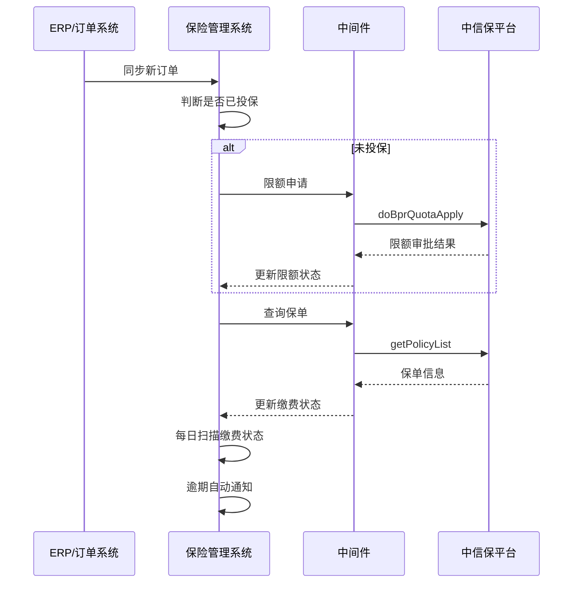
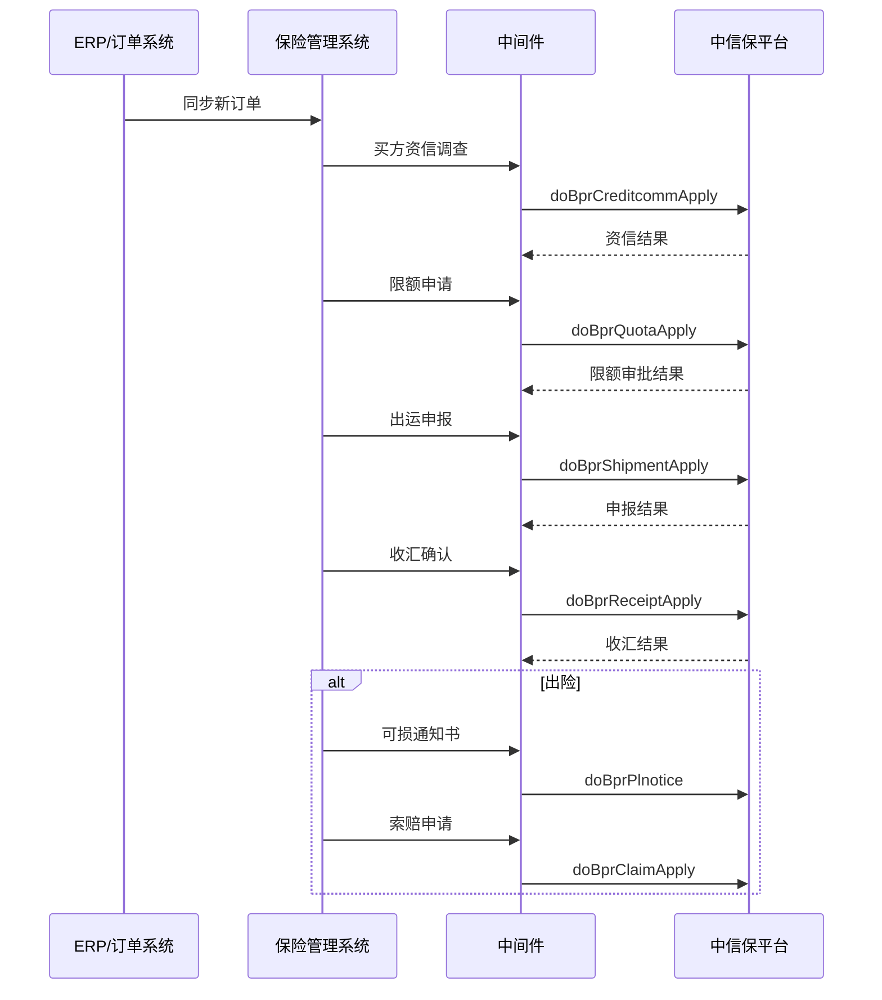

## 业务背景

业务员发现问题：很多出口贸易的订单没有买保险。

董事长要求：**每份订单客户必须买保险**，解决出口和内贸订单的货运风险。

另一个痛点：还有很多逾期未交费的情况，没有准时通知。

一句话总结：**保险覆盖率低 + 缴费逾期无提醒**，两个问题都需要一套系统化的解决方案。

## 中信保开放平台能力

中信保提供了完整的开放平台 API，涵盖出口险和内贸险的全业务链路：

### 出口险核心 API

| 业务场景 | API 名称 | API 路径 |
|----------|----------|----------|
| 限额申请 | 非LC限额申请 | `tradeservice/quota/doBprQuotaApply.nolc` |
| | 企业担保限额申请 | `tradeservice/quota/doBprQuotaApply.nolc.gua` |
| | 备用信用证限额申请 | `tradeservice/quota/doBprQuotaApply.nolc.bk.gua` |
| | 普通信用证限额申请 | `tradeservice/quota/doBprQuotaApply.lc.gen` |
| | 保兑信用证限额申请 | `tradeservice/quota/doBprQuotaApply.lc.con` |
| | 限额倒签申请 | `tradeservice/quotaback/doBprQuotaBackApply` |
| | 限额信息查询 | `tradeservice/quota/getBprQuotaApproveInfo` |
| | 出运限额测算 | `tradeservice/quota/getBprPreQuotaCaculate` |
| 明细申报 | 出运明细申报 | `tradeservice/shipment/doBprShipmentApply` |
| | 迟申报确认 | `tradeservice/shipment/doBprDelayShipmentApply` |
| | 申报信息查询 | `tradeservice/shipment/getBprShipmentApproveInfo` |
| | 出运变更申请 | `tradeservice/shipment/doBprShipmentAlterApply` |
| | 买方月度总额申报 | `tradeservice/shipment/doBprShipmentTotalApply` |
| | 出口前单独申报 | `tradeservice/shipment/doBprPreShipmentApply` |
| 收汇 | 收汇确认 | `tradeservice/receipt/doBprReceiptApply` |
| | 收汇变更 | `tradeservice/receipt/doBprReceiptAlterApply` |
| 买方资信 | 资信调查信息获取 | `tradeservice/creditcomm/getBprCreditcommInfo` |
| | 资信调查确认 | `tradeservice/creditcomm/doBprCreditcommApply` |
| 可损/索赔 | 可损通知书制作 | `tradeservice/plnotice/doBprPlnotice` |
| | 索赔申请 | `tradeservice/claim/doBprClaimApply` |
| | 赔付通知书查询 | `tradeservice/indemnitynotice/getExpIndemnityNoticeInfo` |
| 融资 | 开具承保情况通知书 | `bank/api/v1/finance/notice/apply` |
| | 协议信息查询 | `bank/api/v1/finance/agreement/info` |
| 保单 | 保单信息查询 | `tradeservice/policy/getPolicyList` |
| | 保单文件获取 | `commonservice/common/getPolicyFile` |
| | 在保保单列表 | `commonservice/trade/getTradePolicyList` |
| 报备 | 应收账款余额报备 | `tradeservice/report/doBprBalanceReportApply` |
| | 出口数据总额报备 | `tradeservice/report/doBprTotalBalanceReportApply` |
| 通用 | 数据合规性校验 | `tradeservice/ediApply/getBprEdiApply` |
| | 附件上传 | `commonservice/common/doFileUpload` |
| | 任务跟踪 | `tradeservice/trace/getBprTaskTrace` |

### 内贸险核心 API

| 业务场景 | API 名称 | API 路径 |
|----------|----------|----------|
| 限额 | 限额申请 | `domservice/quota/doBprDomQuotaApply` |
| | 限额信息查询 | `domservice/quota/getBprDomQuotaApplyInfo` |
| 申报 | 普通明细申报 | `domservice/declare/doBprDomDeclareApply` |
| | 买方总额申报 | `domservice/declare/doBprDomDeclareTotalApply` |
| | 供应商总额申报 | `domservice/declare/doBprDomDeclareSupplierApply` |
| | 销售总额申报 | `domservice/declare/doBprDomDeclareSellApply` |
| | 发票补录 | `domservice/declare/doBprDomInvoiceSupplement` |
| | 申报信息查询 | `domservice/declare/getBprDomDeclareApproveInfo` |
| 收款 | 收款确认 | `domservice/receipt/doBprDomReceiptApply` |
| 可损/索赔 | 可损通知书制作 | `domservice/plnotice/doDomPossibleLossApply` |
| | 索赔申请 | `domservice/claim/doDomClaimApply` |
| | 赔付通知书查询 | `domservice/indemnitynotice/getDomIndemnityNoticeInfo` |
| 案件 | 案件撤销 | `domservice/casecancel/doDomCaseCancelApply` |
| | 案件查询 | `domservice/casecancel/getDomCaseInfo` |

### 接入方式

经过团队内部评估，采用 **部署中间件** 的方式对接这些接口。

## 整体架构


---

## 分期规划

整个系统分两期实施：

- **第一期**：解决最迫切的问题——投保覆盖率 + 缴费逾期提醒
    - 订单没买保险
    - 逾期没提醒
- **第二期**：补齐全链路功能——出运申报、收汇、索赔等
    - 出运申报管理
    - 收汇管理
    - 可损与索赔
    - 买方资信 + 宏观数据

---

## 第一期：核心功能（解决最迫切的问题）

第一期聚焦两个核心问题：**订单没买保险** 和 **逾期无提醒**。

### 第一期页面清单

| 序号 | 页面名称 | 核心目标 | 对接 API |
|------|----------|----------|----------|
| 1 | 仪表盘 | 一眼看清投保率和缴费状态 | `getPolicyList`、`getBprTaskTrace` |
| 2 | 订单投保管理 | 确保每笔订单都有保险 | `doBprQuotaApply.*`、`getBprQuotaApproveInfo` |
| 3 | 限额管理 | 限额申请和查询 | `doBprQuotaApply.*`、`getBprQuotaApproveInfo` |
| 4 | 缴费监控 | 逾期预警和自动通知 | `getPolicyList` |
| 5 | 保单管理 | 查看在保保单信息 | `getPolicyList`、`getTradePolicyList`、`getPolicyFile` |

---

### 页面一：仪表盘

系统的「驾驶舱」，一眼看清两个核心问题的状态。


核心指标：

| 指标 | 说明 | 颜色规则 |
|------|------|----------|
| 本月投保率 | 已投保订单 / 总订单数 | <80% 红色，80%-95% 黄色，≥95% 绿色 |
| 未投保订单数 | 还没买保险的订单 | 有数据就红色 |
| 待缴费保单 | 7 天内到期的保单数量和金额 | 有数据就黄色 |
| 逾期未缴费 | 超过缴费期限的保单 | 有数据就红色 |
| 本月新增保单 | 本月新投保的保单数量 | 参考指标 |

**解决的问题：** 管理层打开系统就能看到「投保率多少」「有没有逾期」，不用再问业务员。

---

### 页面二：订单投保管理

这是解决「很多订单没有买保险」问题的核心模块。

**订单投保管理**


**订单投保详情**


#### 2.1 订单列表页

展示所有出口和内贸订单，关键字段：

| 字段 | 说明 |
|------|------|
| 订单编号 | ERP 同步过来的订单号 |
| 客户名称 | 买方信息 |
| 订单金额 | 交易金额和币种 |
| 贸易类型 | 出口险 / 内贸险 |
| 投保状态 | 未投保 / 已申请限额 / 已限额通过 / 已投保 |
| 保险到期日 | 保单有效期 |
| 操作 | 申请限额 / 查看详情 |

操作按钮：

- **一键投保** —— 对未投保的订单，自动调用限额申请 API
- **批量投保** —— 勾选多个订单批量申请
- **投保进度** —— 查看当前投保走到哪一步了

**解决的问题：** 业务员不用再「忘记买保险」，系统自动提醒哪些订单还没投保。

---

### 页面三：限额管理

限额是投保的第一步——先申请买方的信用限额，限额通过后才能出运。

**限额管理**


**订单投保详情**


#### 3.1 限额申请

根据贸易类型选择对应的申请 API：

| 贸易类型 | 调用 API |
|----------|----------|
| 非信用证（无担保） | `doBprQuotaApply.nolc` |
| 非信用证（企业担保） | `doBprQuotaApply.nolc.gua` |
| 非信用证（备用信用证/银行保函） | `doBprQuotaApply.nolc.bk.gua` |
| 普通信用证 | `doBprQuotaApply.lc.gen` |
| 保兑信用证 | `doBprQuotaApply.lc.con` |

申请表单需要填写：

- 买方信息（名称、国家、地址）
- 交易信息（币种、金额、付款方式）
- 担保信息（如有）
- 附件（贸易合同等，调用 `doFileUpload` 上传）

#### 3.2 限额查询

调用 `getBprQuotaApproveInfo` 查询限额审批结果，支持按买方名称、国家、状态筛选。

#### 3.3 买方资信调查

调用 `getBprCreditcommInfo` 获取买方资信信息，调用 `doBprCreditcommApply` 确认资信调查结果。

**解决的问题：** 限额申请从线下搬到线上，审批流程可追溯，状态一目了然。

---

### 页面四：缴费监控

这是解决「逾期未交费」问题的核心模块。

**缴费监控**


**触发紧急通知**


#### 4.1 缴费台账

记录每笔保单的缴费信息：

| 字段 | 说明 |
|------|------|
| 保单号 | 中信保保单号 |
| 保费金额 | 应缴金额 |
| 缴费截止日 | 最晚缴费日期 |
| 实际缴费日 | 实际缴费日期 |
| 缴费状态 | 未缴费 / 已缴费 / 逾期 |
| 逾期天数 | 自动计算 |

#### 4.2 逾期预警规则

- **提前 7 天** —— 黄色预警，系统消息通知经办人
- **提前 3 天** —— 橙色预警，飞书/邮件通知经办人 + 部门负责人
- **逾期 1 天** —— 红色预警，飞书消息 + 短信通知所有人

#### 4.3 自动通知机制

通过 Celery 定时任务每天扫描一次：

```python
# 每天早上 9 点扫描缴费状态
@periodic_task(run_every=crontab(hour=9, minute=0))
def check_payment_overdue():
    today = date.today()
    # 查询 7 天内到期的保单
    upcoming = Policy.objects.filter(
        payment_deadline__lte=today + timedelta(days=7),
        payment_status='unpaid'
    )
    for policy in upcoming:
        days_left = (policy.payment_deadline - today).days
        if days_left <= 0:
            send_urgent_alert(policy)  # 红色预警
        elif days_left <= 3:
            send_warning_alert(policy)  # 橙色预警
        elif days_left <= 7:
            send_reminder(policy)  # 黄色预警
```

**解决的问题：** 从「没人提醒」到「提前 7 天自动预警」，逾期率大幅下降。

---

### 页面五：保单管理

管理在保保单信息，作为缴费监控的数据源。

**保单管理**


**保单详情**


- **保单列表** —— 调用 `getPolicyList` 查询保单信息
- **保单详情** —— 查看保单的详细信息和有效期
- **保单文件** —— 调用 `getPolicyFile` 下载保单 PDF
- **在保保单** —— 调用 `getTradePolicyList` 查看当前有效的保单

**解决的问题：** 保单信息统一管理，不用再翻中信保后台或者 Excel 台账。

---

### 第一期数据流转



### 第一期技术方案

| 层级 | 技术 | 说明 |
|------|------|------|
| 前端 | Vue 3 + Element Plus | 管理后台 UI |
| 后端 | Django 4.2 + DRF | 业务逻辑 + API |
| 中间件 | Python + requests | 中信保接口对接 |
| 任务调度 | Celery + Redis | 定时扫描缴费状态 |
| 数据库 | PostgreSQL | 业务数据存储 |

---

## 第二期：全链路补齐

第一期解决了最迫切的问题后，第二期补齐完整的投保业务链路。

### 第二期页面清单

| 序号 | 页面名称 | 核心目标 | 对接 API |
|------|----------|----------|----------|
| 6 | 出运申报管理 | 每次出运在线申报 | `doBprShipmentApply`、`doBprDelayShipmentApply`、`doBprShipmentAlterApply`、`doBprShipmentTotalApply`、`doBprPreShipmentApply` |
| 7 | 收汇管理 | 收汇确认和变更 | `doBprReceiptApply`、`doBprReceiptAlterApply` |
| 8 | 可损与索赔 | 出险后的处理流程 | `doBprPlnotice`、`doBprClaimApply`、`getExpIndemnityNoticeInfo`、`doDomPossibleLossApply`、`doDomClaimApply`、`getDomIndemnityNoticeInfo` |
| 9 | 买方资信管理 | 买方信用画像 | `doBprCreditcommApply`、`getBprCreditcommInfo` |
| 10 | 任务跟踪 | 中信保待处理任务 | `getBprTaskTrace` |
| 11 | 宏观数据看板 | 国别风险和行业数据 | `getCountryMacroDataV2`、`getIndustryMacroData` |

---

### 页面六：出运申报管理

限额通过后，每次出运都需要申报。

<!-- 截图：出运申报管理页面 -->
<!-- 占位 -->

#### 6.1 出运明细申报

调用 `doBprShipmentApply` 进行出运申报，表单字段：

- 保单号（自动带出）
- 买方信息
- 出运日期、预计收汇日期
- 出运金额、币种
- 货物描述
- 附件（提单、发票等）

#### 6.2 迟申报确认

超过申报期限的出运，调用 `doBprDelayShipmentApply` 进行迟申报确认。

#### 6.3 买方月度总额申报

每月汇总买方的出运总额，调用 `doBprShipmentTotalApply`。

#### 6.4 申报变更

已申报的出运信息有误，调用 `doBprShipmentAlterApply` 进行变更。

#### 6.5 出口前单独申报

特殊场景下的出口前申报，调用 `doBprPreShipmentApply`。

---

### 页面七：收汇管理

出运后的收汇确认。

<!-- 截图：收汇管理页面 -->
<!-- 占位 -->

#### 7.1 收汇确认

调用 `doBprReceiptApply` 进行收汇确认，记录实际收汇日期和金额。

#### 7.2 收汇变更

收汇信息有误，调用 `doBprReceiptAlterApply` 进行变更。

---

### 页面八：可损与索赔

出险后的处理流程。

<!-- 截图：可损与索赔管理页面 -->
<!-- 占位 -->

#### 8.1 可损通知书

- 出口险：调用 `doBprPlnotice` 制作可损通知书
- 内贸险：调用 `doDomPossibleLossApply` 制作可损通知书

#### 8.2 索赔申请

- 出口险：调用 `doBprClaimApply` 提交索赔
- 内贸险：调用 `doDomClaimApply` 提交索赔

#### 8.3 赔付通知书

- 出口险：调用 `getExpIndemnityNoticeInfo` 查询赔付结果
- 内贸险：调用 `getDomIndemnityNoticeInfo` 查询赔付结果

---

### 页面九：买方资信管理

管理买方的信用信息。

<!-- 截图：买方资信管理页面 -->
<!-- 占位 -->

- **资信调查** —— 调用 `doBprCreditcommApply` 发起资信调查
- **资信报告** —— 调用 `getBprCreditcommInfo` 获取调查结果
- **买方画像** —— 整合多次调查结果，形成买方信用画像

---

### 页面十：任务跟踪

跟踪中信保返回的所有待处理任务。

<!-- 截图：任务跟踪页面 -->
<!-- 占位 -->

调用 `getBprTaskTrace` 获取任务列表，自动归类并分配给对应的经办人。

---

### 页面十一：宏观数据看板

利用中信保的宏观数据 API，辅助业务决策。

<!-- 截图：宏观数据看板 -->
<!-- 占位 -->

- **国别风险** —— 调用 `getCountryMacroDataV2`，查看目标国家的风险等级
- **行业数据** —— 调用 `getIndustryMacroData`，了解目标行业的整体信用状况

---

## 第二期数据流转

完整的投保链路：



---

## 中间件设计

中间件负责和中信保 API 的所有通信，核心处理：

1. **证书管理** —— 读取加密公钥，管理证书有效期
2. **数据加密** —— 请求数据用中信保公钥加密
3. **签名验签** —— 请求签名 + 响应验签
4. **重试机制** —— 接口调用失败自动重试
5. **日志记录** —— 所有 API 调用完整记录，方便排查

---

## 分期对比

| 维度 | 第一期 | 第二期 |
|------|--------|--------|
| 核心目标 | 解决投保覆盖 + 逾期提醒 | 全链路业务闭环 |
| 页面数量 | 5 个 | 6 个 |
| API 对接 | 8 个核心 API | 20+ 个 API |
| 开发周期 | 预计 3-4 周 | 预计 4-6 周 |
| 解决的问题 | 订单没保险、逾期无提醒 | 出运、收汇、索赔全流程 |
| 依赖条件 | 中间件部署完成 | 第一期上线运行 |

---

## 实际效果（预期）

### 第一期上线后

- **投保率**：从人工漏投保到系统自动提醒，覆盖率趋近 100%
- **缴费逾期**：从无提醒到提前 7 天预警，逾期率大幅下降
- **效率提升**：限额申请在线化，告别线下流程

### 第二期上线后

- **全流程闭环**：从限额申请到收汇确认到索赔，全链路在线化
- **风险可视**：买方资信、国家风险、行业风险一目了然
- **数据沉淀**：所有投保数据在线管理，为后续的风控分析打下基础

---

*中信保的 API 能力其实很完整，关键是分清优先级。第一期先解决老板最关心的问题——每笔订单都要有保险、逾期要有人提醒。第二期再慢慢补齐全链路功能。先上线、先用起来，比追求大而全重要得多。*
