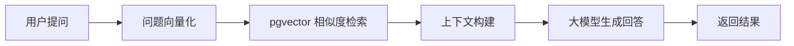
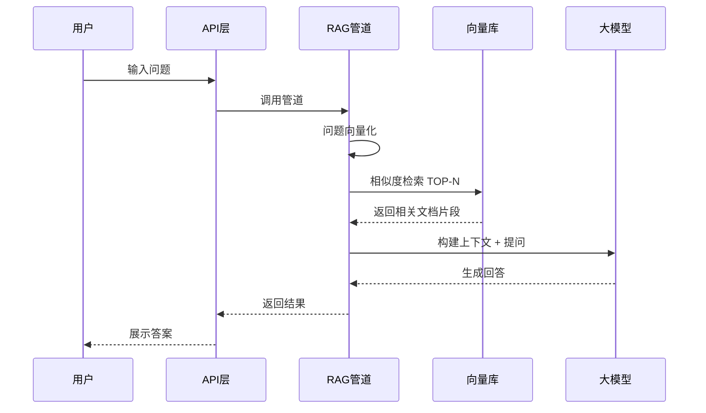

## 为什么要做这个

公司内部有个很现实的问题：新人入职、业务咨询的时候，总是反复问同样的问题——"公司请假制度是什么""报销流程怎么走""产品参数在哪查"。老员工被问烦了，新员工也觉得不好意思一直问。

这些问题的答案其实都有，但散落在各种文档里：有的在钉钉的文档中心，有的在共享盘的 PDF 里，有的干脆在某个同事的脑子里。

所以我想搞一个 **智能问答助手**，把公司的制度、文化、产品信息喂给它，员工有问题直接问它，省时省力。

## 做出来的东西

系统叫 **TianjieAI**，核心能力很简单：

- 员工输入问题 → 系统在知识库里检索相关内容 → 调用大模型生成回答
- 知识库支持上传 PDF、Word、Excel 等多种格式的文档
- 后台可以管理知识库、文档、对话历史
- 支持多轮对话，上下文连贯

目前主要应用在三个方面：

1. **公司制度咨询** —— 请假、报销、考勤、晋升等规章制度
2. **企业文化宣导** —— 价值观、行为准则、团队活动等
3. **产品信息查询** —— 产品参数、规格、常见问题等

说白了就是一个 **专属的企业知识大脑**，把散落各处的知识统一管理起来，员工有问题直接问 AI，不用再翻文档找人了。

## 技术架构

整个系统采用前后端分离架构，核心是 **RAG（检索增强生成）** 管道：

技术栈选型：

| 层级 | 技术选型 | 说明 |
|------|----------|------|
| 后端框架 | Django 4.2 + DRF | 快速开发，接口规范 |
| 数据库 | PostgreSQL + pgvector | 关系数据 + 向量存储一体化 |
| AI 框架 | LangChain | RAG 管道编排 |
| 向量化 | OpenAI Embeddings | 文本转向量 |
| 异步任务 | Celery + Redis | 文档处理、向量化异步执行 |
| 文档处理 | PyPDF / python-docx / openpyxl | 多格式文档解析 |

选 PostgreSQL + pgvector 而不是单独搞一个 Milvus 之类的向量数据库，主要考虑是 **运维简单、成本低**。对于企业内部知识库这个量级的数据，pgvector 完全够用，而且不用多维护一套服务。

## 核心流程

一个典型的问答流程是这样的：

关键的几个环节：

**1. 文档处理阶段**

用户上传的文档（PDF、Word、Excel）会被解析成纯文本，然后按语义切分成小段落。每个段落和原文档的对应关系都会保留，方便溯源。

**2. 向量化阶段**

每个文档片段通过 Embedding 模型转成向量，存入 PostgreSQL 的 pgvector 扩展。同时保留原文内容和元数据（来自哪个文档、哪个章节）。

**3. 检索阶段**

用户的问题同样转成向量，然后在 pgvector 里做余弦相似度检索，找到最相关的 TOP-N 个文档片段。

**4. 生成阶段**

把检索到的文档片段作为上下文，连同用户问题一起交给大模型，让大模型基于这些参考资料生成回答。这就是 RAG 的核心思想——**先检索，再生成**。

## 知识库管理

系统支持多知识库管理，每个知识库可以独立配置：

- **分层结构**：知识库 → 文档库 → 段落库 → 向量库，四级递进
- **多格式支持**：PDF、Word、Excel、PPT、HTML、纯文本
- **权限控制**：不同知识库可以设置不同的访问权限
- **标签管理**：方便对文档进行分类和检索

## 开发中的一些思考

**为什么不用现成的产品？**

市面上有不少 RAG 产品，比如 MaxKB、FastGPT、Dify 等。但这些产品要么是 SaaS 服务（数据安全性存疑），要么功能过于庞大（很多用不上），要么定制性不够强。

自己造轮子的好处是：**知道每一层做了什么，出了问题能排查，想改哪里改哪里。** 对于企业内部应用来说，这种掌控力很重要。

**pgvector 够不够用？**

对于企业内部知识库，文档量通常在几千到几万份，这个量级 pgvector 毫无压力。如果后续数据量上去了，可以考虑换 Milvus 或 Qdrant，但目前没必要过度设计。

**RAG 的效果取决于什么？**

实测下来，影响最大的是 **文档分块策略** 和 **检索质量**。分块太大，检索不精准；分块太小，上下文不完整。这块还在持续优化中。

## 实际效果

上线之后，几个明显的变化：

1. **新人入职培训效率提升** —— 以前需要老员工花半天讲的制度，现在 AI 直接答
2. **重复性问题大幅减少** —— 老员工被问的次数明显少了
3. **知识沉淀** —— 以前散落在各处的文档，现在统一管理在知识库里
4. **可追溯** —— 每个回答都能追溯到具体的知识来源，不存在 AI 瞎编的问题

---

*企业内部的知识管理一直是个难题，有了 AI 之后，至少"找答案"这件事可以变得更简单。ManxiAI 不是终点，而是一个起点——后续还会继续迭代，把更多场景接入进来。*
