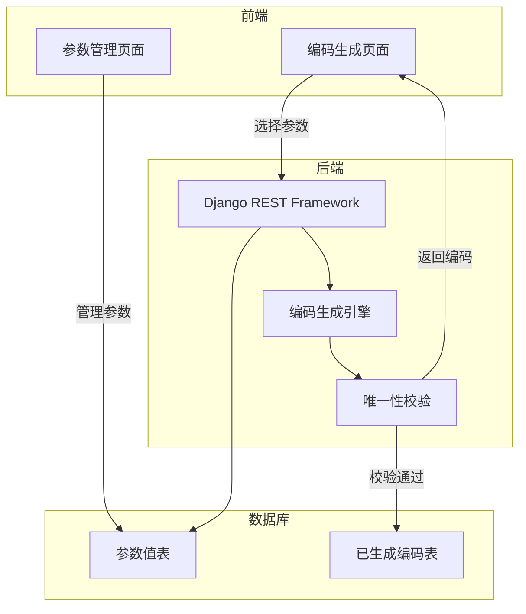

## 一个灵魂拷问

"你们公司产品编码换了几次了？"

这个问题问出去，10 家制造企业里有 8 家会苦笑。

第一次换：公司刚起步，谁编的谁记得住，能用就行。
第二次换：上了 ERP，发现原来的编码规则不兼容，推倒重来。
第三次换：上了 MES，ERP 的编码和 MES 的编码对不上，又得改。
第四次换：换了领导，新领导觉得以前的编码不规范，再换一次。

每次换编码，都是一场灾难——历史数据要迁移、系统要改接口、员工要重新培训、客户那边的物料编码也得跟着改。

## 为什么编码总是换

说白了就三个原因：

**原因一：编码规则写在 Excel 里，没有系统化。**

大部分公司的编码规则是这样的：一个 Excel 表格，里面列了编码的组成逻辑，比如"类别码 + 流水号"。但这个 Excel 谁都能改，改了也不一定通知到所有人。张三按这个规则编，李四按那个规则编，同一个物料三个编码的情况太常见了。

**原因二：编码规则跟不上业务变化。**

公司业务是动态的——新产品上线、新原材料引进、新工艺应用，编码规则需要同步扩展。但 Excel 里的规则是死的，改起来费劲，改完还得通知所有人。于是就出现了"老产品用老编码、新产品用新编码"的混乱局面。

**原因三：没有从源头管控。**

编码是谁都能编的——技术部编、采购部编、仓库也编。每个部门各编各的，没有统一入口，没有校验机制，没有唯一性检查。一物多码是必然结果。

## 编码混乱的代价

编码不统一，看似只是"名字不一样"，实际上影响的是整条数据链路：

| 影响环节 | 具体表现 |
|----------|----------|
| ERP | 同一个物料在 ERP 里有多条记录，库存数据不准 |
| MES | 工艺参数绑定的编码和 ERP 对不上，生产数据断裂 |
| 采购 | 同一个供应商的物料，不同人用不同编码采购，无法汇总 |
| 仓库 | 出入库数据混乱，库存盘点对不上 |
| 质检 | 质检标准绑定了错误的编码，检验数据失真 |
| 财务 | 成本核算数据不准确，利润算不清楚 |

一句话：**编码是制造业数字化的地基，地基歪了，上面盖的楼再漂亮也白搭。**

## 踩过的坑：编码里那些"不能用"的字符

这个问题不踩不知道，一踩就是血泪教训。

我们最早设计编码的时候，觉得用 `*`、`/`、`\`、`?` 这些特殊字符挺好的——比如用 `*` 表示某种特殊规格分隔符，用 `/` 表示比例关系。结果呢？

**技术文件保存不了。**

Windows 文件名不允许包含 `*`、`/`、`\`、`?`、`<`、`>`、`|`、`:`、`"` 这些字符。而我们技术部的工艺文件、SOP 文件、检验报告，文件名里都要带产品编码。编码里有个 `*`，文件保存的时候直接报错——"文件名包含非法字符"。

这不是小事，直接影响的是：

1. **技术文件命名失败** —— 工艺文件、SOP 文件命名带编码，编码有非法字符，文件根本存不上
2. **ERP 附件上传失败** —— 有些 ERP 系统的附件管理也遵循 Windows 文件命名规则，编码带特殊字符的附件传不上去
3. **共享盘文件管理混乱** —— 文件名里有 `/` 的话，操作系统会把它当成目录分隔符，直接创建失败
4. **自动化脚本报错** —— 批量处理文件的脚本遇到非法字符直接崩溃

所以后来我们定了一条铁律：**编码只能用字母、数字、短横线（-）和下划线（_），其他字符一律不允许。**

```markdown
✅ 合法编码：BV-1.5-RE-450_750-0001
❌ 非法编码：BV/1.5*RE?450:750#0001
```

这个规则写进了编码生成引擎的校验逻辑里——生成编码时自动检测，包含非法字符直接拒绝生成。**从源头杜绝问题，比出了问题再补救靠谱得多。**

> 💡 **经验教训：** 设计编码规则的时候，不能只考虑"编码好不好记"，还要考虑"编码下游的系统和工具能不能兼容"。Windows 文件名、Linux 文件名、数据库字段、URL 参数，每个场景都有自己的字符限制。编码规则设计得越"干净"，后续的麻烦越少。

## 解决方案：参数驱动的自动编码

与其反复"换编码"，不如一步到位搞一套 **参数驱动的自动编码系统**。

核心思路就一句话：**编码规则由系统管理，编码生成由系统执行，人只需要选参数。**

### 设计原则

1. **唯一性** —— 系统保证同一个物料只有一个编码，不可能出现一物多码
2. **可追溯** —— 编码由参数组成，看到编码就知道这个物料是什么类别、什么规格
3. **可扩展** —— 新产品上线？加个参数就行，不用改代码
4. **不可篡改** —— 编码一旦生成，不允许手动修改，保证数据一致性
5. **系统兼容** —— 编码只允许字母、数字、短横线（-）、下划线（_），不使用任何特殊字符，确保 Windows/Linux/数据库/URL 全场景兼容

### 编码结构设计

以线缆行业为例，一个产品编码由多个参数段组成：

```
类别码 - 材料码 - 规格码 - 护套码 - 电压码 - 流水号
  AA     BB      CC       DD       EE      0001

示例：
BV-1.5-RE-450/750-0001
│    │   │    │      │
│    │   │    │      └── 流水号：该类别下的第 1 个产品
│    │   │    └── 电压等级：450/750V
│    │   └── 护套类型：RE（普通）
│    └── 规格：1.5mm²
└── 类别：BV（铜芯聚氯乙烯绝缘电线）
```

每个参数段都有独立的管理后台，管理员可以配置参数名称、参数值、参数顺序。

### 系统架构



### 核心功能

#### 一、参数树管理

管理员维护编码的参数体系——哪些参数、什么顺序、每个参数有哪些可选值。

<!-- 截图：参数树管理页面 -->
<!-- 占位 -->

参数树是整个编码系统的「骨架」：
- 顶层是产品大类（如电线、电缆、光缆）
- 每个大类下面挂不同的参数（材料、规格、护套、电压等）
- 每个参数下面定义可选值

新产品上线？在对应大类下加个参数节点就行。规格变了？改个参数值就行。**不用动代码，配置即开发。**

#### 二、参数值管理

每个参数的可选值在这里维护：

<!-- 截图：参数值管理页面 -->
<!-- 占位 -->

比如"导体材料"这个参数，下面可以选：铜、铝、铜包铝。
比如"电压等级"这个参数，下面可以选：300/500V、450/750V、0.6/1kV。

可选值是有限的、受控的，这就从源头杜绝了手误输入乱七八糟的数据。

#### 三、编码生成页面

这是业务员日常用得最多的界面——选好参数，点一下生成，编码就出来了。

<!-- 截图：编码生成页面 -->
<!-- 占位 -->

操作流程：
1. 选择产品大类
2. 依次选择每个参数的值
3. 点击"生成编码"
4. 系统自动拼接参数、校验唯一性、生成编码
5. 编码生成后不可修改，直接关联到产品主数据

#### 四、编码查询与追溯

输入编码或选择参数条件，快速查询已有的编码：

<!-- 截图：编码查询页面 -->
<!-- 占位 -->

- 支持按编码模糊搜索
- 支持按参数组合筛选
- 显示编码的完整参数组成
- 显示编码关联的 BOM、工艺文件、质检标准

## 和之前的系统有什么不同

| 维度 | 以前（Excel 手工编码） | 现在（系统自动编码） |
|------|------------------------|----------------------|
| 编码规则 | 写在 Excel 里，谁都能改 | 系统管理，权限控制 |
| 编码生成 | 人工编，容易重复 | 系统生成，保证唯一 |
| 参数管理 | 散落在各处 | 统一管理，可追溯 |
| 新产品上线 | 改 Excel + 通知所有人 | 加参数节点，自动生效 |
| 编码查询 | 翻 Excel 找 | 搜索框一搜就有 |
| 和 ERP/MES 对接 | 手动录入，容易出错 | 编码一次生成，多系统共享 |

## 实际效果

上线之后，几个明显的变化：

- **一物多码彻底消灭** —— 系统保证唯一性，不可能出现同一个物料两个编码
- **新产品上线效率提升** —— 以前改 Excel + 通知所有人要半天，现在配置参数 10 分钟搞定
- **编码数据质量拉满** —— 所有编码由系统生成，格式统一、规则一致
- **跨系统数据打通** —— ERP、MES、WMS 用同一套编码，数据流转不再断裂

---

*编码这件事看起来不起眼，但它决定了整条数据链路的质量。与其反复"换编码"，不如一开始就用系统把编码管起来。规则写在系统里，比写在 Excel 里靠谱得多。*
